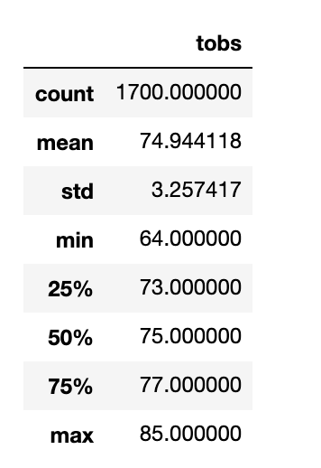
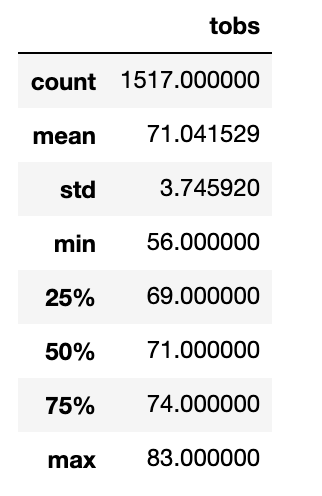

# surfs_up
## Overview of Analysis

The purpose of this analysis is to understand the temperature trends in Oahu to determine if a surf and icecream shop will be a viable business 12 months a year. This data will be used to convince W. Avy to invest in this surf and shake shop in order to get it off of the ground.

## Results

Before analyzing the results, below are the summary statistics for the temperatures in June and December.

June Summary Statistics                    | December Summary Statistics  
:--------------------------------:|:--------------------------------:
 |  

## Summary
### results summary
### additional queries