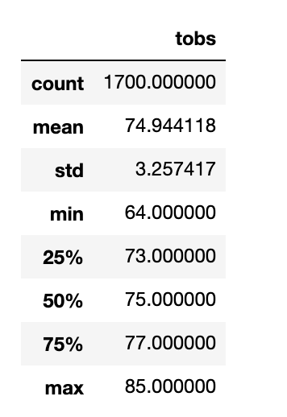
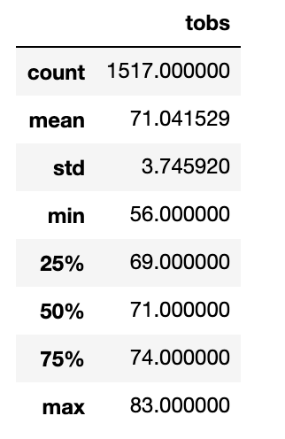
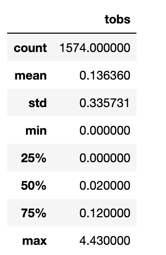
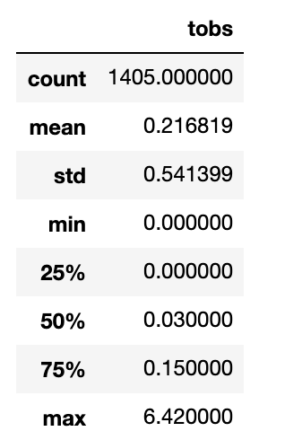

# surfs_up
## Overview of Analysis

The purpose of this analysis is to understand the temperature trends in Oahu to determine if a surf and icecream shop will be a viable business 12 months a year. This data will be used to convince W. Avy to invest in this surf and shake shop in order to get it off of the ground.

## Results

Before analyzing the results, below are the summary statistics for the temperatures in June and December.

June Temperature Summary Statistics                    | December Temperature Summary Statistics  
:--------------------------------:|:--------------------------------:
 |  

After looking at the tables, we can draw a few conclusions:

- The average temperatures in June (~75) and December (~71) are fairly similar. Additionally, weather in the 70s is moderate to warm. 
- The standard deviations of the temperatures in June and December are also strikingly similar. December has slightly more variable temperatures with a standard deviation of ~3.74 as compared to June which has a standard deviation of ~3.26. 
- In December, the minimum temperature is 56 degrees while in June the minimum temperature is 64 degrees. On the higher end, the maximum temperatures are very similar - June with a max temperature of 85 and December with a max temperature of 83.

## Summary

After looking at the summary statistics for the weather in June and December, it seems as though the weather is very similar. There may be a day or two in December where it is too cold to surf, but given the similar average temperatures, there aren't too many days that are too cold to surf. If we look at the first quartile, we can also see that in December it is only below 69 degrees 25% of the time. 

### Additional Queries
1. Precipitation difference between June and December. The queries for this data can be found in the ReadMe_addtl_info folder. Below are the summary statistics for the precipitation in June and December.

June Precipitation Summary Statistics                    | December Precipitation Summary Statistics  
:--------------------------------:|:--------------------------------:
 |  

After looking at the tables, there is not a strong difference in the amount of rain the June and December. More importantly, there is not a lot of rain in either month.

2. Temperature differences based on weather station. In order to get the most accurate data, it may make sense to look at the closest weather station to our location. I did not run this query as the location of the surf and shake shop is currently unknown. 